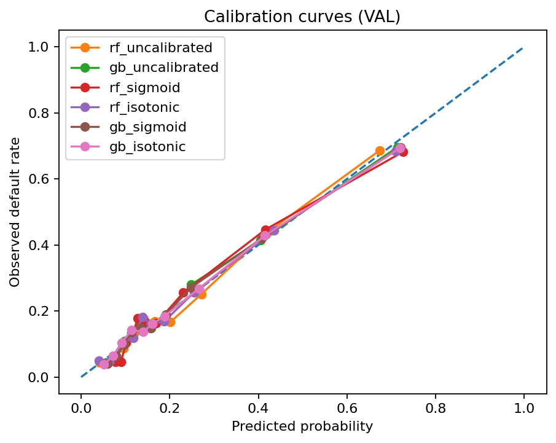

# Credit Risk — Default Prediction (PD) | UCI Credit Card Dataset

Portfolio project focused on **credit risk (probability of default / PD)** using classical ML + probability calibration.  
Goal: build a **reproducible pipeline** and produce **risk-ready probabilities** with clear documentation.

## Dataset
- Source: UCI / Kaggle mirror (Default of Credit Card Clients)
- Rows: 30,000 | Columns: 25
- Target: `default.payment.next.month` (1 = default, 0 = non-default)

> Raw data is stored locally under `data/raw/` and is **not committed** to GitHub.

## Project structure
- `src/data/` — data loading + normalization + splitting
- `src/models/` — training, tuning, calibration, evaluation
- `reports/` — metrics outputs and leaderboard
- `docs/` — Model Card, Data Card, Evidence Log

## Reproducible setup
```bash
python3.11 -m venv .venv
source .venv/bin/activate
pip install -r requirements.txt
```

## End-to-end run (recommended)
### 1) Put the dataset in the expected location
Place the CSV here (exact name):
- `data/raw/default_of_credit_card_clients.csv`

### 2) Validate + normalize raw data
```bash
python src/data/make_dataset.py
```
Output: `data/raw/default_of_credit_card_clients__normalized.csv` (local only)

### 3) Create train / validation / test splits (stratified)
```bash
python src/data/prepare_dataset.py
```
Output: `data/processed/{X_train,X_val,X_test,y_train,y_val,y_test}.csv`

### 4) Train candidate models (VAL metrics)
```bash
python src/models/train_baseline.py
python src/models/train_rf.py
python src/models/train_gb_best.py
```

### 5) Calibrate probabilities (risk-ready PD)
```bash
python src/models/calibrate_models.py
```

### 6) Build the validation leaderboard
```bash
python src/models/build_leaderboard.py
```
Output: `reports/leaderboard.csv`

### 7) Final evaluation on held-out TEST (one-time)
```bash
python src/models/final_test_eval.py
```
Output: `reports/final_test_metrics.json`

## Results (current)
### Champion (final test)
- Model: **Random Forest + Isotonic calibration**
- Test ROC-AUC: **0.7833**
- Test PR-AUC: **0.5580**
- Test Brier: **0.1345**

## Calibration (validation)
We evaluate probability calibration to ensure predicted PDs are reliable for risk decisioning.




## Why calibration matters (credit risk)
In credit risk, we don’t only want a model that ranks customers well (ROC-AUC / PR-AUC).  
We also want predicted probabilities that behave like a **real PD**. Calibration helps align predicted probabilities with observed default rates, improving decisioning and thresholding.

## Notes
- `data/raw/` and `data/processed/` are ignored by git.
- Training/tuning decisions should be based on **validation**; the **test** set is used once at the end.

## Documentation (to fill)
- Model Card: `docs/model_card.md`
- Data Card: `docs/data_card.md`
- Evidence Log: `docs/evidence_log.md`
